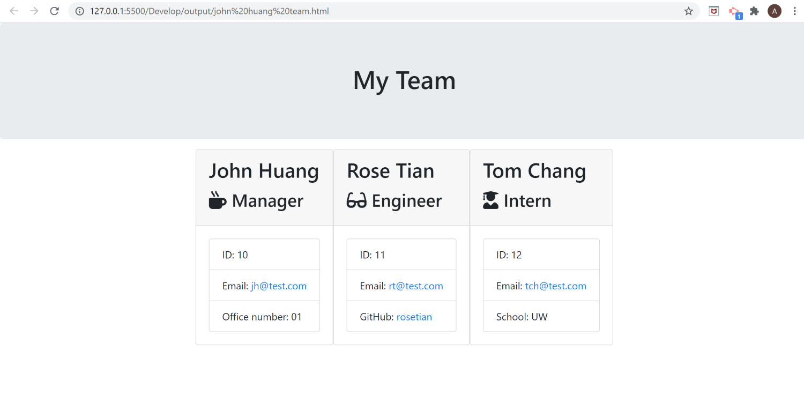

# Template Engine - Employee Summary

## Description

This project is to build a software engineering team generator command line application that is able to gather each employee information by prompting questions as well as generates an HTML webpage that displays summaries for each person in one development team.

## Table of Contents

- [Instructions](#instructions)
- [Installation](#installation)
- [Class](#class)
- [Screenshot](#screenshot)
- [Demo](#demo)
- [License](#license)
- [Questions](#questions)

## Instructions

### User input:

- When user run `npm app.js` in command line application, user will be prompted questions about adding employees or creating a team. User can do either add emplyees first or create a team first.

- The team will include three type of roles: managers, engineers and inters. They will be prompted for the same questions: name, id , and email , and a specific question for each role of employees in the prompted question. ( For example, a manager may provide with an office number, an engineer may provide with a GitHub username and an intern may provide with his/her school name. )

### Roster output:

- If user choices to add emplyoees fisrt, he/she will answer the prompted questions about emplyees' information. The team will be created after user is done with adding employees. When user selects to create a team, he/she will be prompted to give a team name to generat the html file in the output folder, that displays a nicely formatted team roster along with the input of each team member’s information.

- If user choices to create a team first, user will be prompted to give a team name for genenating a html file in the output folder. And then user can add employees' information on this team html file at anytime he/she wants after it is created.

## Installation

Run `npm install` in in command line in order to install the following npm package dependencies as specified in the `package.json`:

- `inquirer` : for collecting input from the user with `npm app.js`.
- `jest` : for running the provided tests with `npm test`.

## Class

One supper `class`: Employee, and three sub `classes`: Manager, Engineer, Intern to extend Employee were applied to build the `object constructions (OOP)`. The tests for these classes in the `tests directory (TDD)` are all passed.

## Screenshot

## Demo

[DemoLink](https://drive.google.com/file/d/1sDwageNduHvQvDh2EH8N0Hp9Bo5hkW_7/view?usp=sharing)

## License)

## Questions

If you have any questions about this this application, please feel free to reach me via the link of my [GitHub](https://github.com/aprilyanggarwood) and my Email: <aprilyanggarwood@gmail.com>
